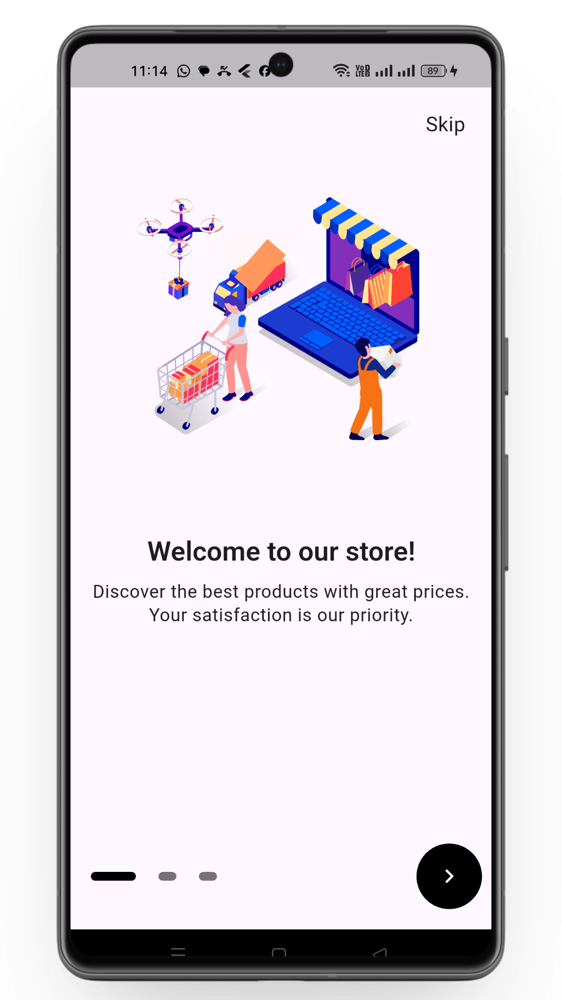
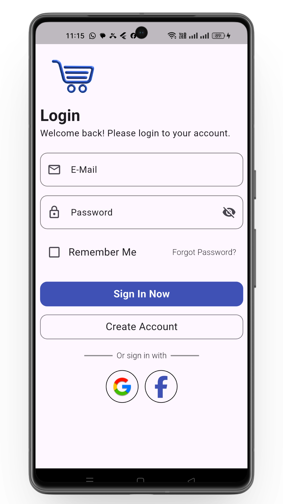
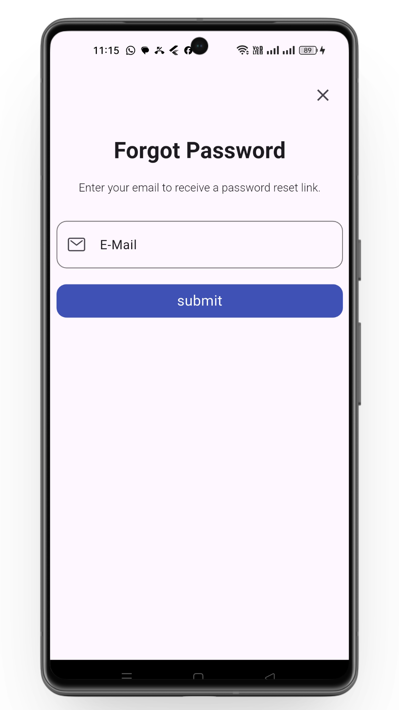
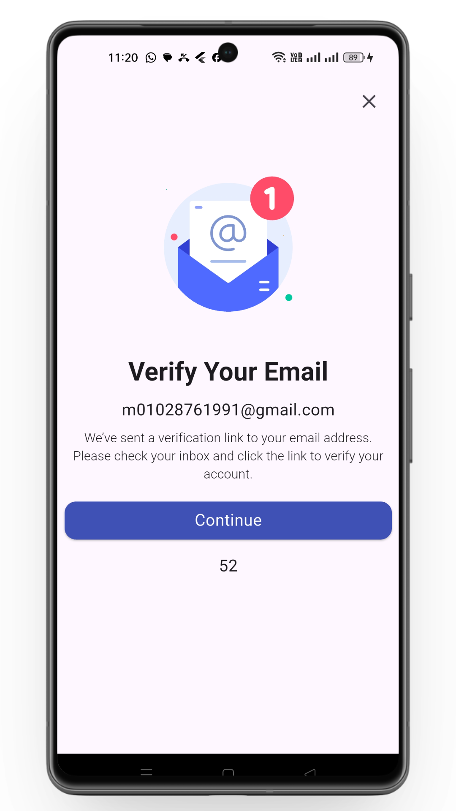
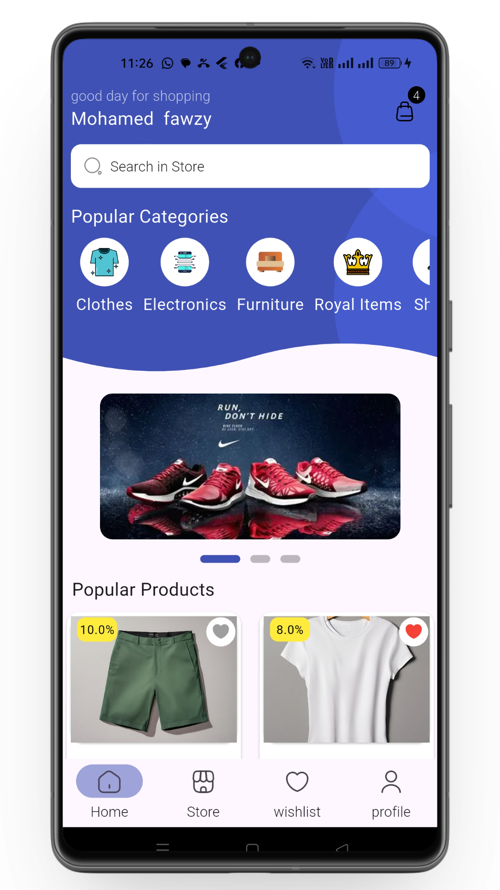
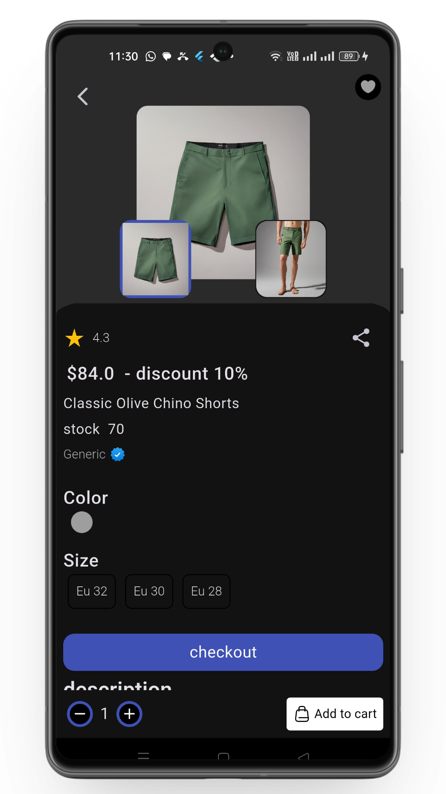
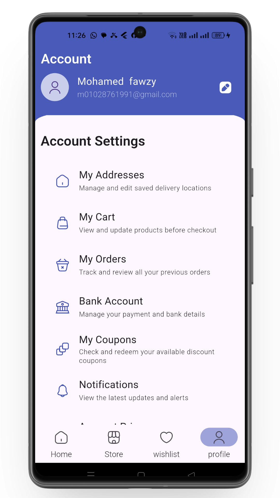
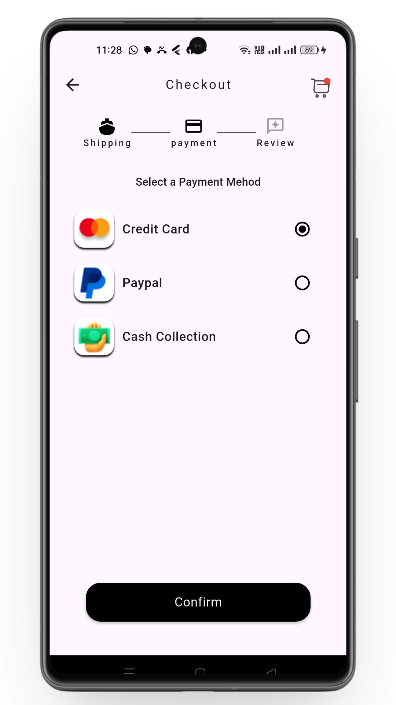

# 🛍️ Flutter Multi-Category E-Commerce App

Mobile e-commerce application built with `Flutter` to sell **clothing, electronics, and accessories**.  
Supports **multi-language**, **online/offline usage**, and **secure online payments**. Designed with **Clean Architecture** for scalability and maintainability.

---

## 📌 Table of Contents 
- [Screenshots](#-screenshots)
- [Features](#-features) 
- [Tech Stack](#-tech-stack)
- [Architecture](#-architecture)
- [State Management](#-state-management)
- [Local Storage (Hive)](#-local-storage-hive)
- [API Integration](#-api-integration)
- [Dependency Injection](#-dependency-injection)
- [Performance](#-performance)
- [License](#-license) 
- [Local Notifications](#-Local-Notifications)

---

## 📸 Screenshots
Add your screenshots inside:
<table>
<tr>
  <td></td>
  <td></td>
  <td></td>
  <td></td>
  <td></td>
  <td></td>
  <td></td>
  <td></td>
</tr>
</table>

---

## 🚀 Features
- 🛍️ **Products** – Browse clothing, electronics, and accessories  
- 🛒 **Shopping Cart** – Add/remove items, edit quantities  
- 🔐 **User Authentication** – Login/Signup with `Firebase Auth`  
- 🌐 **Multi-language Support** – Using `AppLocalization`  
- 📶 **Online & Offline Support** – Smooth experience in any network condition  
- 📺 **Streaming Page** – Display promotions or live content  
- 💳 **Online Payments** – Support for **Paymob** & **PayPal**  
- 🌙 **Dark Mode / Light Mode** – User preference  
- 🏗️ **Clean Architecture** – Scalable and maintainable code  
- 🧩 **Dependency Injection** – Using `GetIt` / `Injectable`  
- ⚡ **Optimized Performance** – Caching, pagination, and isolates for heavy operations  

---

## 🛠 Tech Stack
- **Flutter** (Frontend)  
- **Dart** (Programming Language)  
- **Firebase** (Auth, Firestore, Storage)  
- **Cubit (Bloc)** (State Management)  
- **Hive** (Local Storage)  
- **Dio** (API requests)  
- **AppLocalization** (Multi-language support)  
- **Clean Architecture**  
- **Dependency Injection** (`GetIt` / `Injectable`)  
- **Isolates** (Performance optimization)  

---

## 🏛 Architecture
This project follows **Clean Architecture**, providing:  
- Separation of concerns  
- Scalability for future features  
- Testable modules  
- Maintainable and modular code structure  

---

## 🧠 State Management
Using **Cubit (Bloc)** for:  
- UI State Control  
- Loading & Error Handling  
- Cart Management  
- Checkout State  
- Product List & Details State  

---

## 🗄 Local Storage (Hive)
Hive is used to:  
- Cache products & categories  
- Save user preferences  
- Improve app performance  
- Reduce unnecessary API calls  

**Benefits:**  
- Very fast  
- Non-blocking UI  
- Supports large datasets  

---

## 🔌 API Integration
- Fetch products, categories, and orders  
- Handle online payments via **Paymob** & **PayPal**  
- Network requests using **Dio**  
- Interceptors for logging & error handling  
- Retry mechanism  
- Clean API service layer  

---

## 🧩 Dependency Injection
Using **GetIt / Injectable** for:  
- Repositories  
- UseCases  
- API Services  
- Cubits  
- Local storage  

Ensures modular, testable, and maintainable architecture.  

---

## ⚡ Performance Boosters
- **Isolates** for heavy operations  
- **Hive caching** for offline & fast data load  
- **Pagination** for product lists  
- **Low memory usage**  
- Smooth and responsive UI  

---
## 🔔 Local Notifications
The app uses **local notifications** to alert users about important events and updates within the app itself, without requiring an internet connection.

- **flutter_local_notifications** package for scheduling notifications  
- Supports **immediate and scheduled notifications**  
- Can show notifications for **orders, promotions, or reminders**  
- Fully works in **offline mode**  
- Customizable **title, body, and icons** 

---
## 📄 License
This project is licensed under the MIT License - see the LICENSE file for details.